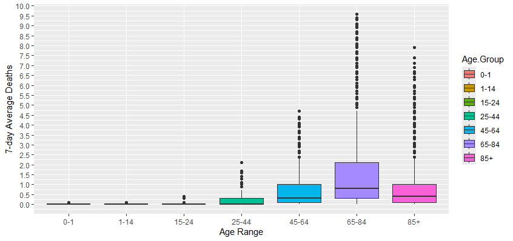
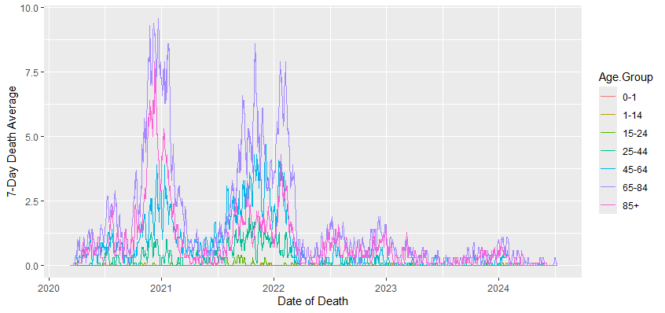
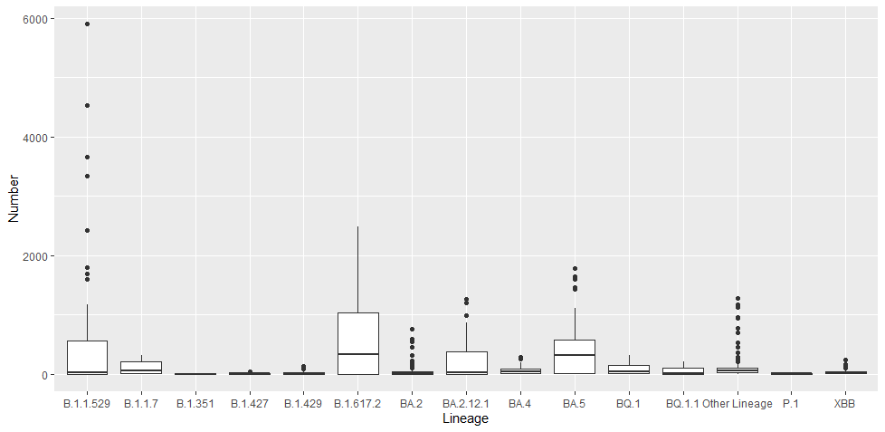
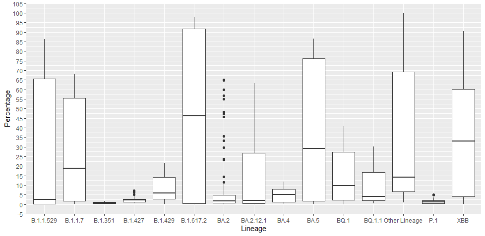
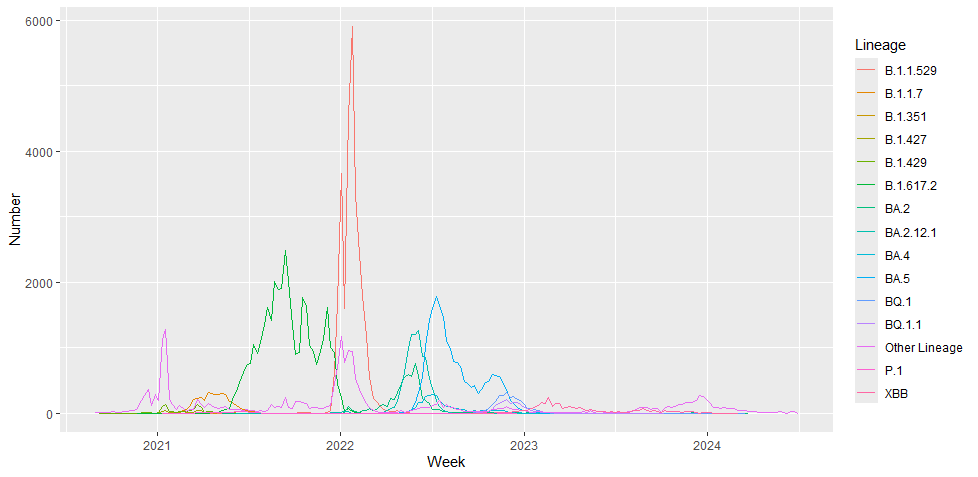
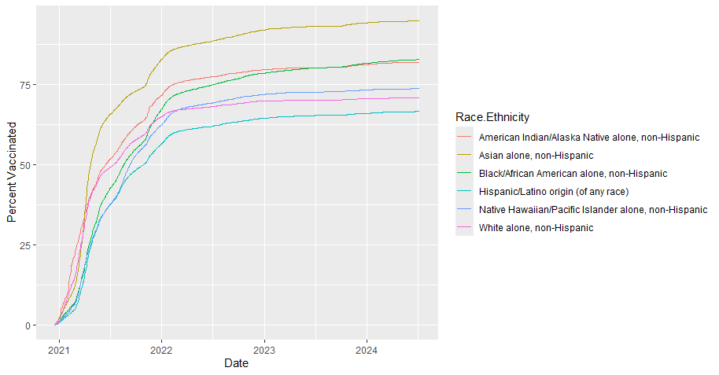
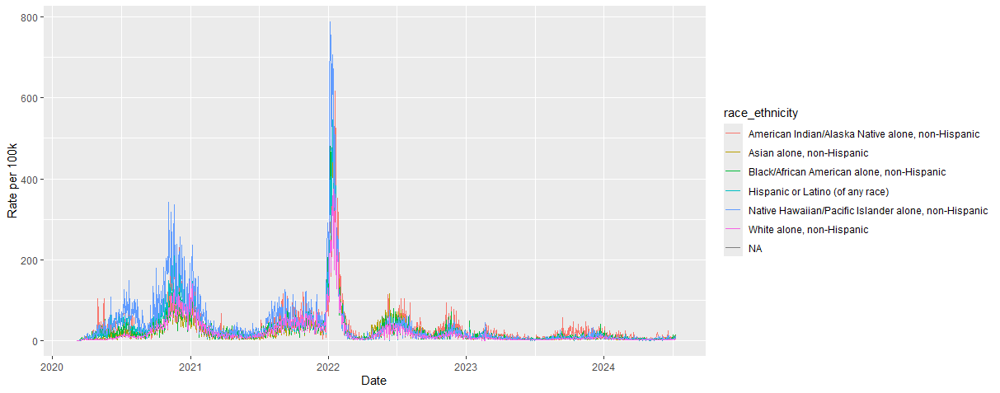
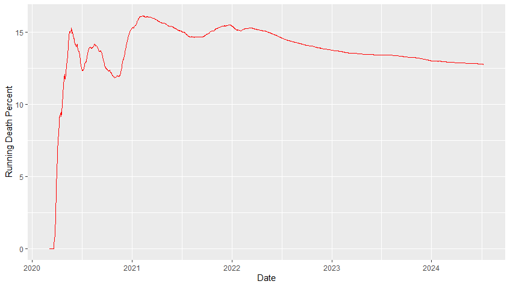
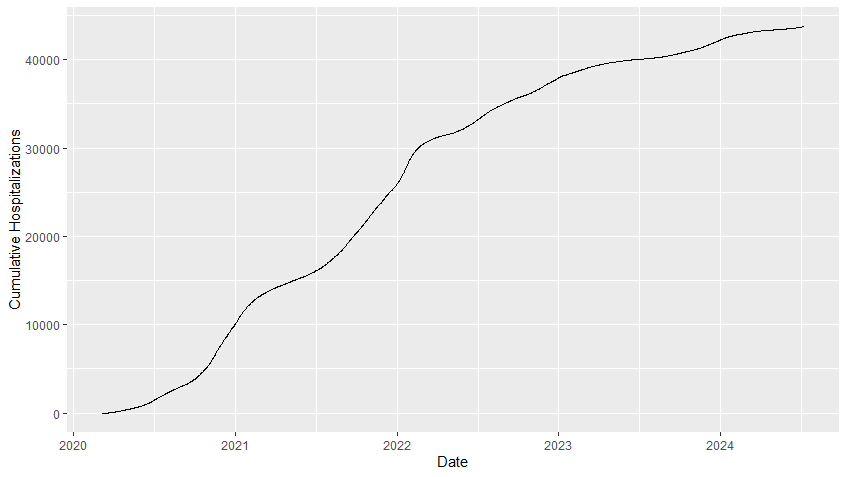
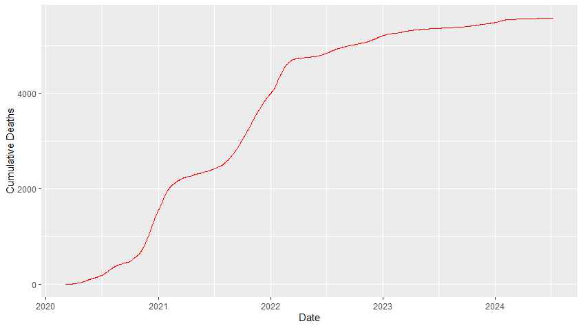

Machine Learning to Model Public Health Data During Covid-19
  Background: Although the exact timing of spikes in Covid-19 cases is hard to predict, certain events seem to inevitably lead to an uptick in Covid-19 infections year to year. An example of this can be seen by observing the rise in new case numbers following the holiday season, particularly following Christmas. Unfortunately, this uptick in cases tends to also lead to an uptick in death totals. It has become clear that certain demographics were uniquely impacted by the pandemic.
  
  Objective: Using publicly available data about Covid-19 case rates in January 2022, a machine learning linear regression model was employed to predict 7-day average Covid-19 fatalities based on the day of the month. As it is well-documented that people with Covid-19 can be reinfected, it is expected that without intervention a similar pattern of fatalities across the month of January 2023 would occur. However, due to vaccination, fatalities were significantly reduced in January 2023. The regression will be repeated for 2023's data. The difference between the regression will be used to estimate the approximate lives spared by vaccination in the month of January 2023. To further explore interesting aspects of the pandemic, graphs and boxplots will be generated using ggplot in R. Interesting aspects about the unique impact of the pandemic on different demographics will be highlighted. 
  
  Findings: The data visualization performed in this project supports that the oldest two age groups in Utah suffered many more fatalities during the course of the pandemic, even despite public awareness that the older population was particularly vulnerable.

  
The lesser number of fatalities in the oldest population group nevertheless represents a much higher proportion of individuals in the age group. In addition, viral sequence data shows that the pandemic in Utah was largely driven by three variant waves (B.1.617.2 starting in Summer 2021, B.1.1.529 starting at the new year in 2022, and BA.5 in Summer 2022) 

However, many fatalities occurred prior to the availability of sequencing data, at the start of 2021. 

The data support that at around the start of 2022, vaccinations plateaued at around 65% of the population. It is possible that at around this time vaccination and continuing infections led to a degree of herd immunity to protect against future spikes in cases. Indeed, following the peak in cases during the Summer of 2022, no dramatic spikes in cases are reported.

Interestingly, at approximately the same time in 2022 the 7-day average fatality percentage of people admitted to hospitals for Covid began to drop, suggesting that even among hospitalized individuals, a lower proportion was dying.

Similarly, there is an apparent reduction in the number of hospitalizations over time starting in 2022.
 Together, these data indicate a noticeable turn in the pandemic took place in 2022 at a time when the percentage of the population that had been vaccinated reached approximately 65%. This makes sense in light of research published in early 2022 about the percentage vaccinated that would need to be reached in order to achieve herd immunity. 
  
  An early estimate by the WHO in 2020 about Covid-19's Ro value suggested that it could be as high as around 2.5 (https://pmc.ncbi.nlm.nih.gov/articles/PMC7073717/). Nevertheless, there is extensive disagreement about the accuracy and efficacy of Ro values due to high variability in published research about Ro values in 2020 (https://pmc.ncbi.nlm.nih.gov/articles/PMC9517346/#:~:text=The%20pooled%20R%200%20for%20COVID%2D19%20was%20estimated%20to,CI%2C%202.41%E2%80%932.94).). A 2022 study published in Nature suggests the Ro values for Covid-19 may have been overestimated in the German population and were actually around 1.01-1.68, depending on the season (https://www.nature.com/articles/s41598-022-22101-7). Vaccine effectiveness is another measure to consider, which again is highly variable in the literature. A very recent study about current vaccines' effectiveness for preventing hospital visits in adults found 33% effectiveness (https://www.cdc.gov/mmwr/volumes/74/wr/mm7406a1.htm). Because the primary observation made in this project is based on a reduction in the death rate of individuals hospitalized for Covid, this measure of vaccine effectiveness may be warranted. Such a method is similar to the Nature's method of estimating Ro in principle due to the focus on measures of mortality. If indeed the apparent shift in the pandemic in 2022 was a result of "herd immunity," using Figure 1 found in (https://pmc.ncbi.nlm.nih.gov/articles/PMC9144560/), the Ro value for Utah could have been around 1.25, very similar to the value in Nature's article. 
  
If, however, vaccine effectiveness should measure effectiveness against infection, research reported values near 90% (https://pmc.ncbi.nlm.nih.gov/articles/PMC8595975/#:~:text=For%20those%20fully%20vaccinated%20against,was%20found%20to%20be%2065.7%25.). Again assuming herd immunity was reached at the time in 2022, this methodology would lead one to obtain an Ro value of 2.5. The difference in estimate Ro values depends on whether vaccine effectiveness is measured as ability to prevent hospitalizations in adults up to 119 days after vaccination (33%) or to prevent infections for fully vaccinated individuals (~90%). The Nature article proved prescient in suggesting that this virus, like so many others that cause respiratory infections, would repeatedly mutate and become seasonal rather than fully eradicated. As was suggested, adoption of strategies using mortality to estimate Ro for respiratory infections rather than numbers of infections is warranted when discussing vaccination efforts to achieve "herd immunity."

Fewer deaths in January 2023 is indicative of vaccine efficacy and herd immunity. A downward trend for the death rates of individuals hospitalized with Covid early in 2022 may have coincided with herd immunity as it was taking effect. 

Importantly, although the curve showing cumulative fatalaties indicates some dependence on season, after initial fluctuations leading up to 2021 the death rate remained relatively stable across seasons until 2022 when the rate began to steadily decline. 

Besides this, infection rates in Utah also indicate a certain dependence on season, yet unlike in the Nature article a slight uptick in infections is apparent in the summer months prior to an extreme peak late in the colder season. The infection peaks in 2022 are markedly dampened until a significant plateau in 2023 and beyond.

Apart from some effect of herd immunity, it is otherwise unclear what specifically could lead to such sudden and drastic reductions in the death rate of hospitalized individuals starting in 2022. An obvious explanation could be that hospitals were stretched less thin, yet fluctuations in the death rate would be expected seasonally if this were the case. One plausible explanation could involve differences in viral load. Though studies are conflicting, there is plenty research in support of the idea that vaccination status could lead to reductions in viral load and systemic symptoms up to six months post-vaccination, potentially even in those that are hospitalized (https://pmc.ncbi.nlm.nih.gov/articles/PMC8982774/). Other explanations could include that a new and less virulent strain took hold. This would not make sense because in mid 2022, the most common strain was BA.5, which is considered, if anything, a more severe lineage than the omicron variant (B.1.1.529) that accounted for the drastic peak in cases in early 2022. (https://www.sciencedirect.com/science/article/pii/S277270762400050X).

It appears likely that vaccination not only provided herd immunity that reduced dramatic peaks in cases, but also improved outcomes in patients that were hospitalized (possibly by reducing viral load and systemic symptoms). Using public data about hospitalizations and hospital deaths in Utah related to Covid, excess mortalities related to Covid can be more directly calculated. Ro of the viruses in Utah can be estimated based off of vaccine effectiveness for preventing hospitalization and 65% vaccination. Similar to the article in Nature, this methodology for identifying herd immunity arises from observing changes in mortality. Others have calculated the effective reproduction rate Re of the virus in Utah, finding that it dropped below 1 shortly after the dramatic peak in January 2022, providing evidence that the surge in cases and high percentage of vaccinated population coincided with subsequent herd immunity (https://epiforecasts.io/covid/posts/subnational/united-states/utah/). This project brings to light a reduction in the death rate of hospitalized individuals as a potential indicator of herd immunity.

Because of the evidence supporting the impact of vaccines in Utah and data found in date.ipynb and date2.ipynb, it is reasonable to conclude that the vaccination efforts contributed to sparing somewhere close to 300 Utahn lives in the month of January 2023 alone.
